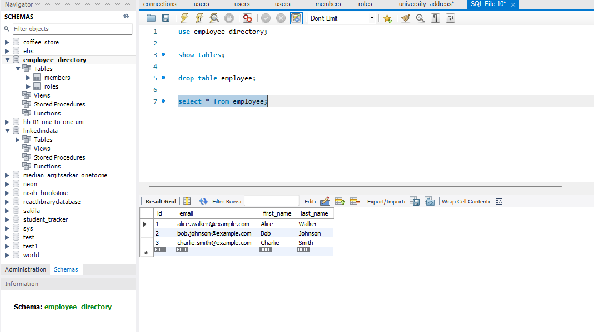

# 👨‍💼 Employee Management REST API

This is a Spring Boot project that implements basic CRUD(Create, Read, Update, Delete) operations for managing employee data via RESTful APIs. It serves as a foundational project to understand how Spring Boot works with REST endpoints and an MySQL database.

📌 Features
- Create a new employee
- Retrieve all employees
- Retrieve an employee by ID
- Update employee details
- Delete an employee
- RESTful API architecture
- MySQL Database

Well-structured with best practices using Spring Boot annotations

🧱 Technologies Used
- Java 17+
- Spring Boot
- Spring Data JPA
- MySQL
- Maven
- JUnit and Mockito
- Docker

Backend Setup 
1. Clone the repositor:
2. Update the database configuration in <code>application.properties</code>
3. Build the project:
4. Run the application:

Flow of the Program 
1. Initally there is no table in database 'employee_directory' called 'employee'.

2. After running the Spring Boot Application, 'employee' table is created.

3.Initially, the table is blank.

4. Hitting the GET <code>http://localhost:8080/api/employees</code> API using Postman.

blank JSON response.

5. Hitting the POST <code>/api/employees</code> API using Postman with JSON data.
   {
   "firstName": "Alice",
   "lastName": "Walker",
   "email": "alice.walker@example.com"
   }
 
6. Checking the data in MySQL Workbench.
 
1 employee created. 
Why first_name and last_name columns are blank? 
OOPS! the column names are different in Employee POJO class, than the JSON data we provided.

7. Lets create another employee the same way.

2nd employee created. Let's check in the database.
 
Now it is good.
8. Let's create 2 more employee.

 
Check in the database. 

9. Check using the get all employee API using Postman.

10. Check get employee by ID API using Postman.
 
11. Check Put employee API using Postman.

database data ->

12. Lets Delete employee record 4.
Before deleting -> 

Postman Screenshot -> 

After deleting -> 
 

API Endpoints
1. Create Employee
- POST <code> /api/employees</code>
  {
  "firstName": "Jane",
  "lastName": "Smith",
  "email": "jane.smith@example.com"
  }
2. Get All Employees
- GET <code> /api/employees</code>
3. Get Employee by ID
- GET <code> /api/employees/1</code>
4. Update Employee
- PUT <code> /api/employees</code>
{
"id": 1,
"firstName": "Jane Updated",
"lastName": "Smith",
"email": "jane.updated@example.com"
}
5. Delete Employee
- DELETE <code> /api/employees/4</code>